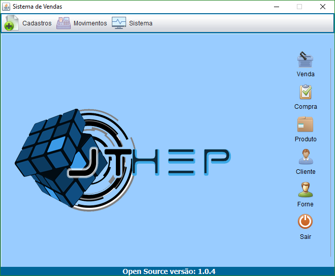

<h1>Pequeno-Sistema-de-Vendas-Java</h1>

Trabalho com finalidade de obter nota na disciplina de Projeto Interdisciplinar.

Softwares utilizados:
  <ul>
    <li>JDK - 11</li>
    <li>NetBeans IDE 8.2</li>
    <li>MySQL Server 5.1.53-community</li>
    <li>MySQL Connector JDBC 5.1.23</li>
    <li>MySQL Workbench</li> 
    <li>Windows 10</li>
    <li>Enterprise Architect Trial</li>
  </ul>

<h3> Acesso ao Sistema</h3>

<b>Usuario: adm</b>

<b>Senha: 123</b>

Pré Visualização

mais informações

https://drive.google.com/drive/folders/1Zx7tIFGjCRU3m6GbARXoNtBW9BCGllmA?usp=sharing

